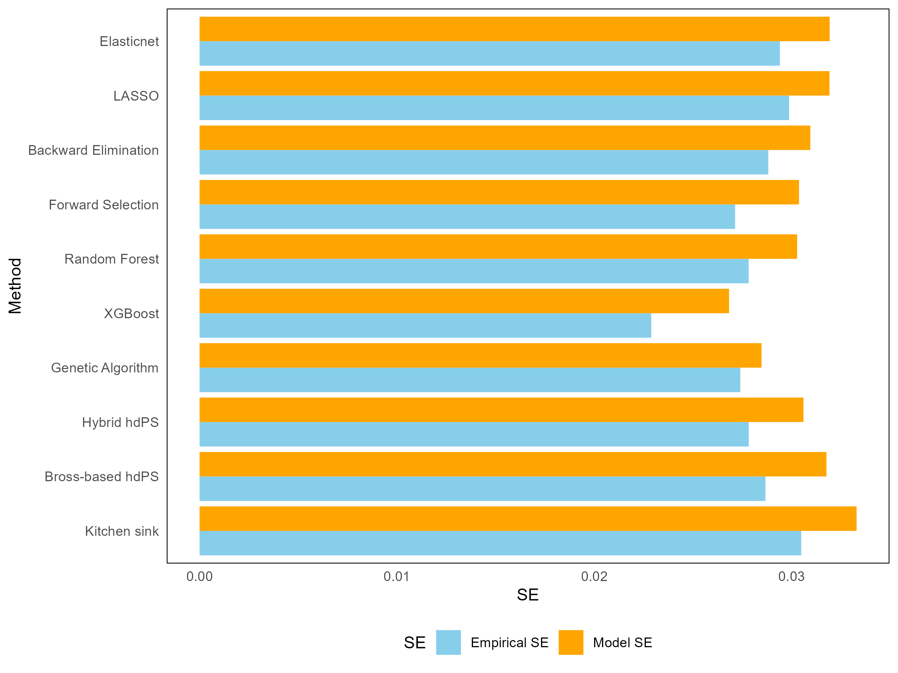
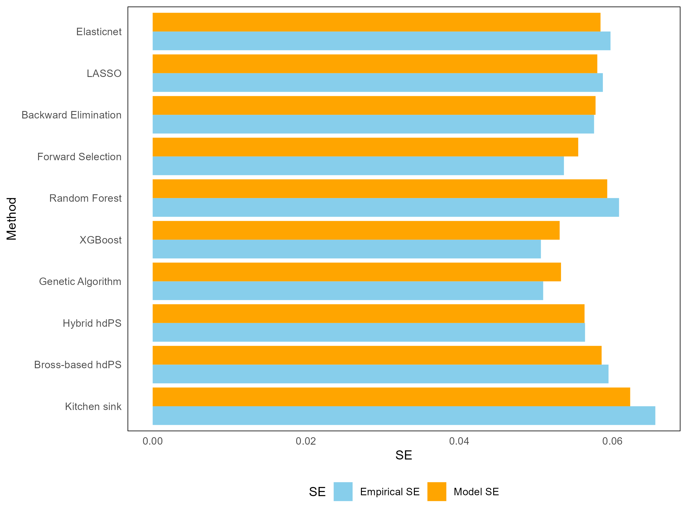

\appendix
\counterwithin{figure}{section}
\counterwithin{table}{section}

\edef\tablename{\appendixname~\tablename}
\edef\figurename{\appendixname~\figurename}

# Variables Used for Plasmode Simulation Data Generation

1. Original demographic variables (8)

- age, 
- sex, 
- education, 
- race, 
- marital status, 
- income, 
- country where born, 
- survey cycle

2. Original behaviour variables (5)

- smoking, 
- diet, 
- high cholesterol, 
- physical activity, 
- sleep

3. Original health history / access variables (2)

- diabetes family history, 
- medical access

4. Transformed lab variables (6) (complex forms) based on original lab variables: uric acid, protein, bilirubin, phosphorus, sodium, potassium, globulin, calcium, systolic blood pressure, diastolic blood pressure.

- Tranfored.var.1 = log(globulin)
- Tranfored.var.2 = protein*calcium
- Tranfored.var.3 = diastolicBP/systolicBP)^2
- Tranfored.var.4 = sqrt(uric acid+bilirubin)/2
- Tranfored.var.5 = phosphorus^2/(sodium*potassium)
- Tranfored.var.6 = log(systolicBP+10)

5. Count based prescription codes (1) (proxies of comorbidity)

Simple count (1 variable) = sum of selected ICD-10 CM codes (converted to recurrence covariates) who had less than 0.8 or greater than 1.2 compared to the outcome = $\sum_{s=1}^{94} R_s$

# True outcome model for Plasmode Simulation Data Generation

Diabetes (outcome) =  Obese (exposure) + demographic/behaviour/health history variables + transformed lab variables + simple count with selected ICD-10 codes

# SE comparison

```{r, echo=FALSE, out.width="100%", fig.cap="Standard Error Comparison for Different Methods (Overall) when outcome and exposure are frequent.", fig.align="center", fig.label="fig:se-comparison-overall"}

```

```{r, echo=FALSE, out.width="100%", fig.cap="Standard Error Comparison for Different Methods (Overall) when outcome is frequent but exposure is rare.", fig.align="center", fig.label="fig:se-comparison-overall"}

```

```{r, echo=FALSE, out.width="100%", fig.cap="Standard Error Comparison for Different Methods (Overall) when outcome is rare but exposure is frequent", fig.align="center", fig.label="fig:se-comparison-overall"}

```