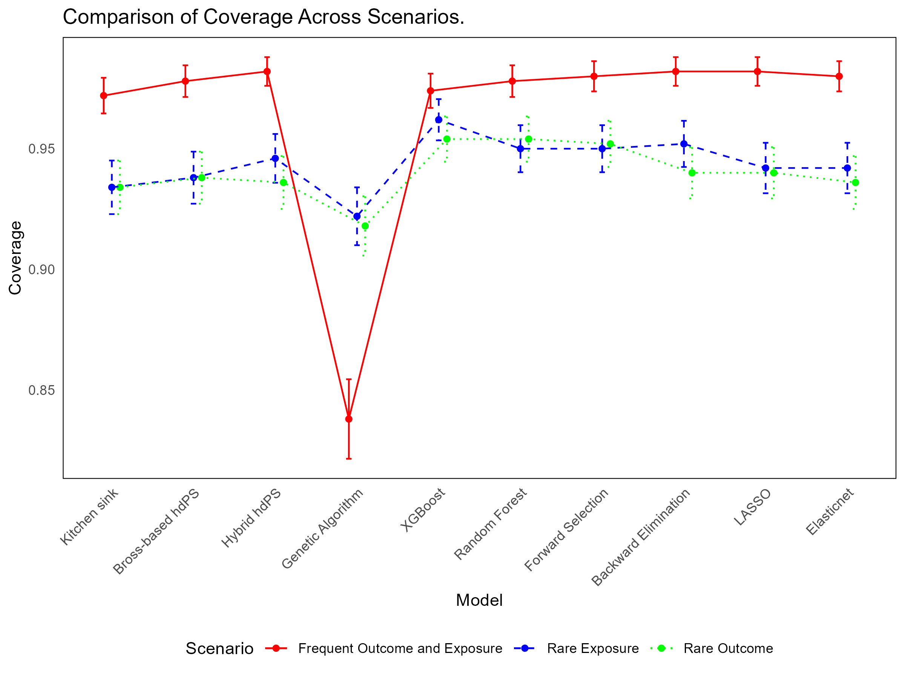

```{r setup, include=FALSE}
knitr::opts_chunk$set(
  echo = FALSE, # By default, hide code; set to TRUE to see code
  fig.pos = 'th', # Places figures at top or here
  out.width = '100%', dpi = 300, # Figure resolution and size
  fig.env="figure",
  out.extra = ""
) # Latex figure environment

options(knitr.table.format = "latex") # For kable tables to write LaTeX table directly
```

# Background


**Aim**: The aim of this research is to systematically evaluate and compare different proxy selection methods within the context of high-dimensional propensity score (hdPS) analysis. Specifically, the study focuses on assessing how these methods, including alternative variable selection approaches, perform in selecting proxy variables for confounding adjustment compared to the traditional Bross method within the hdPS framework. We seek to determine whether these alternative methods offer superior performance in estimating treatment effects compared to the default Bross formula.

# Methods

## Data and Simulation {-}

**Motivating Example**: To explore the relationship between obesity and the risk of diabetes, we revisited this association using data from three cycles of the National Health and Nutrition Examination Survey (NHANES) covering the years 2013-2014, 2015-2016, and 2017-2018 [@karim2024high]. This analysis was informed by a thorough review of the existing literature [@saydah2014trends;@liu2013association;@kabadi2012joint;@ostchega2012abdominal]. To identify relevant covariates, we constructed a causal diagram based on established causal inference principles [@greenland1999causal]. The covariates included in our analysis were carefully selected and categorized into Demographic, Behavioral, Health History, Access-related, and Laboratory variables [@karim2024high]. While most of these variables were binary or categorical, the Laboratory variables were continuous.

**Plasmode simulation**: To rigorously assess the performance of the methods under consideration, we employed a plasmode simulation framework, which is particularly well-suited for reflecting real-world data structures and complexities [@franklin2014plasmode]. This approach was modeled after the analytic dataset derived from NHANES and involved resampling from the observed covariates and exposure information (i.e., obesity) without altering them. By mirroring key aspects of an actual epidemiological study, this simulation framework offers a significant advantage over traditional Monte Carlo simulations, which often rely on idealized assumptions. 

**Simulation scenarios under consideration**: Our plasmode simulation was conducted over 500 iterations. For the base simulation scenario, we set the prevalence of exposure (obesity) and the event rate (diabetes) at 30%, with a true odds ratio (OR) parameter of 1, corresponding to a risk difference (RD) of 0. Each simulated dataset had a sample size of 3,000 participants. The description of other scenarios under consideration is provided in Table \ref{table:scenarios}.

\begin{table}[ht]
\centering
\caption{Overview of Plasmode Simulation Scenarios Reflecting Varying Exposure and Outcome Prevalences Based on National Health and Nutrition Examination Survey (NHANES) Data Cycles (2013-2018)}
\label{table:scenarios}
\begin{tabular}{lcccc}
  \toprule
  \textbf{Plasmode Simulation Scenario} & \textbf{Exposure} & \textbf{Outcome} & \textbf{True} & \textbf{Sample}\\
  \textbf{} & \textbf{Prevalence} & \textbf{Prevalence} & \textbf{Odds Ratio} & \textbf{Size}\\
  \midrule
  (i) Frequent Exposure and Outcome (Base) & 30\% & 30\% & 1 & 3,000 \\
  (ii) Rare Exposure and Frequent Outcome & 5\% & 30\% & 1 & 3,000 \\
  (iii) Frequent Exposure and Rare Outcome & 30\% & 5\% & 1 & 3,000 \\
  \bottomrule
\end{tabular}
\end{table}

**True Data Generating Mechanism Used in Plasmode Simulation**: The primary goal of this study is to evaluate various variable selection methods under realistic conditions. To achieve this, we formulated the outcome data based on a specific model specification that incorporates both exposure and covariates, including investigator-specified and proxy variables. The model specification consists of three key components:

1. *Investigator-Specified Covariates*: We retained the original investigator-specified covariates, which were either binary or categorical, reflecting how real-world studies typically operate.

2. *Transformation of Laboratory Variables*: In real-world studies, it is common for analysts to lack precise knowledge of the true model specification. To simulate this uncertainty, we transformed the continuous laboratory variables using complex functions such as logarithmic, exponential, square root, polynomial transformations, and interactions. This reflects the challenges analysts face in correctly specifying models when dealing with continuous data.

3. *Inclusion of Proxy Variables*: Real-world studies often deal with unmeasured confounding, which researchers attempt to mitigate by adding proxy variables. However, when a large number of proxies are added, some may act as noise variables, contributing little to the analysis. To simulate this, we selected only those binary proxy covariates (referred to as recurrence covariates in hdPS terminology) that had a relative risk (RR) of less than 0.8 or greater than 1.2 concerning the outcome. Out of 143 proxy covariates, 94 met this criterion and were included in calculating a simple comorbidity burden measure. The remaining 49 covariates were excluded from this calculation and considered noise. This comorbidity burden measure was then incorporated into our model specification for generating the plasmode data.

**Performance Measures**: From this simulation, we derived several performance metrics to evaluate the effectiveness of the methods under consideration: (1) bias, (2) average model standard error (SE; the average of estimated SEs obtained from a model over repeated samples), (3) empirical SE (the standard deviation of estimated treatment effects across repeated samples), (4) mean squared error (MSE), (5) coverage probability of 95% confidence intervals, (6) bias-corrected coverage, and (7) Zip plot [@morris2019using; @white2023check].

## Estimators under consideration {-} 

The comparison between the data generation process and the analysis process reveals two key differences: (i) The data generation used transformed laboratory variables, whereas the analysis was conducted using only the original laboratory variables. (ii) The data generation employed a simple sum of selected proxy variables (sum of 94 proxy covariates), while the analysis included all proxy variables (143 binary proxies), with 49 of these acting as noise variables. These differences help us assess how the proxy variable selection methods handle model misspecification and the presence of noise variables.

1. **Kitchen sink model**: This is a base model for comparison, where no variable selection approaches were used. All investigator-selected features and all proxy variables were used to model [@karim2018can].  

2. **Bross formula**: The Bross formula is a statistical method used to calculate the bias introduced by not adjusting for a covariate [@bross1966spurious]. In hdPS analysis, this formula was originally applied to each proxy variable to measure and rank the potential bias if the covariate were not adjusted for. In our analysis, the 100 proxies with the highest bias rankings are selected for further modeling [@schneeweiss2009high; @wyss2018erratum].

3. **Least Absolute Shrinkage and Selection Operator (LASSO)**: LASSO is a variable selection technique that limits the number of variables by adding a penalty term to the regression model. Cross-validation (CV) is used in LASSO to identify variables with non-zero coefficients in the best model by optimizing the penalty value [@franklin2015regularized; @schneeweiss2017variable; @karim2018can].

4. **Hybrid of hdPS and LASSO**: Instead of relying solely on LASSO for variable selection, a hybrid approach combines the Bross formula and LASSO. First, hdPS variables are selected using the hdPS algorithm (e.g., the top 100), and then LASSO is applied to further refine the selection [@karim2018can; @franklin2015regularized].

5. **Elasticnet**: Elastic Net is an extension of LASSO that includes an additional penalty term to handle multicollinearity by grouping correlated features and selecting the most representative ones [@karim2018can].

6. **Random Forest**: The Random Forest (RF) algorithm is an ensemble learning method that constructs multiple decision trees to perform classification [@breiman2001random]. It calculates the importance of each proxy variable based on the decrease in impurity or Gini importance, providing a ranking of the proxies. The top 100 variables from this ranking are manually selected for further modeling [@schneeweiss2017variable].

7. **XGBoost**: XGBoost is a gradient boosting algorithm used to optimize machine learning models [@chen2016xgboost]. It builds decision trees that make splits based on maximum impurity reduction, and it assigns an importance score to each proxy variable by calculating the mean decrease in impurity [@xiao2024interpretable].

8. **Stepwise**: Stepwise selection is a progressive feature selection method that can proceed in two directions—forward or backward—based on the maximum adjusted R-squared. We have implemented two versions: (a) Forward selection (FS) starts with an initial model (e.g., including all investigator-selected features) and adds proxies to the model one at a time. (b) Backward elimination (BE) starts with a full model (e.g., all investigator-selected features and all proxy variables) and removes features one at a time based on their contribution to the model.

9. **Genetic algorithm (GA)**: GA is an evolutionary algorithm inspired by the theory of natural selection [@holland1975adaptation]. It operates by evolving offspring from a population of the fittest individuals over several generations, evaluating and selecting the best combination of features or variables that maximize prediction accuracy.


# Results

```{r, echo=FALSE, out.width="100%", fig.cap="Comparison of Bias Across Different Methods in hdPS Analysis", fig.align="center", fig.label="fig:bias-comparison"}
knitr::include_graphics("figures/metric_comparison_Bias.png")
```

```{r, echo=FALSE, out.width="100%", fig.cap="Comparison of Coverage Probability Across Different Methods in hdPS Analysis", fig.align="center", fig.label="fig:bias-comparison"}

```


# Real-world analysis

*Here we include full data analysis (with some summary results like exposure and outcome prevalence, and sample size) and report OR and RD. Also mention how many proxies were chosen (add in the picture of RD and OR; side by side for each method, ordered my magnitude of RD), and how many were in common with hdPS (add table).*

```{r, echo=FALSE, fig.align="center", fig.height=6, fig.width=8, fig.cap="Figure presenting a comparison of Risk Differences (RD) and Odds Ratios (OR) with 95% confidence intervals for different methods used to evaluate the association between obesity and diabetes risk. The analysis is based on data from the National Health and Nutrition Examination Survey (NHANES) for the years 2013-2018. Methods are arranged by the number of variables used in the models.", fig.label="fig:comparison-plot", message=FALSE, warning=FALSE}
library(ggplot2)
library(dplyr)

# Combine RD and OR data into a single data frame
data_combined <- data.frame(
  Method = rep(c("Bross", "Hybrid", "LASSO", "Elasticnet", "GA", "XGBoost", "RF", "FS", "BE"), 2),
  # These are approximate values
  Value = c(0.078, 0.078, 0.080, 0.080, 0.079, 0.080, 0.080, 0.080, 0.080, 
            1.50, 1.53, 1.55, 1.55, 1.55, 1.53, 1.55, 1.55, 1.55),
  LowerCI = c(0.06, 0.05, 0.06, 0.06, 0.06, 0.05, 0.06, 0.06, 0.06,
              1.40, 1.40, 1.45, 1.45, 1.45, 1.40, 1.45, 1.45, 1.45),
  UpperCI = c(0.09, 0.10, 0.10, 0.10, 0.10, 0.10, 0.10, 0.10, 0.10,
              1.60, 1.65, 1.65, 1.65, 1.65, 1.65, 1.65, 1.65, 1.65),
  Measure = rep(c("RD", "OR"), each = 9),
  Variables = rep(c(100, 49, 60, 69, 64, 48, 100, 59, 59), 2)
)

# Create a new Method label that includes the number of variables
data_combined <- data_combined %>%
  mutate(MethodLabel = paste(Method, " [", Variables, "]", sep = ""))

# Reorder the factor levels of MethodLabel based on the number of variables
data_combined$MethodLabel <- factor(data_combined$MethodLabel,
                                    levels = unique(data_combined$MethodLabel[order(data_combined$Variables)]))

# Create the plot with the reordered MethodLabel
ggplot(data_combined, aes(x = Value, y = MethodLabel)) +
  geom_point(size = 4) +
  geom_errorbarh(aes(xmin = LowerCI, xmax = UpperCI), height = 0.2) +
  facet_grid(. ~ Measure, scales = "free_x") +
  labs(x = "Value",
       y = "Method [Chosen number of proxies]") +
  theme_minimal() +
  theme(strip.text = element_text(size = 12, face = "bold"))
```

Table \ref{tab:method-comparison} presents a pairwise comparison of the number of proxy features shared between different variable selection methods used in the analysis. Each cell in the table indicates the count of common proxy variables selected by the method in the corresponding row and column. The diagonal cells, where the row and column methods are the same, represent the total number of proxy variables selected exclusively by each method.

\begin{table}[htbp]
\centering
\caption{Comparison of variable overlap of selected proxies across different methods used to evaluate the association between obesity and diabetes}
\label{tab:method-comparison}
\begin{tabular}{lccccccccc}
\toprule
 & \textbf{Bross} & \textbf{Hybrid} & \textbf{LASSO} & \textbf{Elasticnet} & \textbf{GA} & \textbf{XGBoost} & \textbf{RF} & \textbf{FS} & \textbf{BE} \\
\midrule
\textbf{Bross formula} & 100 & & & & & & & & \\
\textbf{Hybrid (Bross and LASSO)} & 49 & 49 & & & & & & & \\
\textbf{LASSO} & 47 & 47 & 60 & & & & & & \\
\textbf{Elasticnet} & 54 & 48 & 60 & 69 & & & & & \\
\textbf{Genetic algorithm (GA)} & 44 & 28 & 36 & 40 & 64 & & & & \\
\textbf{XGBoost} & 38 & 24 & 28 & 30 & 25 & 48 & & & \\
\textbf{Random Forest (RF)} & 72 & 37 & 42 & 50 & 36 & 48 & 100 & & \\
\textbf{Forward selection (FS)} & 45 & 41 & 51 & 54 & 35 & 25 & 43 & 59 & \\
\textbf{Backward elimination (BE)} & 45 & 41 & 51 & 54 & 35 & 25 & 43 & 59 & 59 \\
\bottomrule
\end{tabular}
\end{table}


**Computing time**: 

*Report computing time for the Real-world analysis for each method. (add ordered table)*

# Discussion

**Contextualizing the literature**: 

**Summary of the simulation findings**: 

**Data analysis findings**: 

**Future Direction**: 

**Conclusion**: 


# List of abbreviations {-}

1. MSE - Mean Squared Error
2. SE - Standard Error
3. PS - Propensity Score
4. AE - Autoencoders
5. DL - Deep Learning
6. MARS - Multivariate Adaptive Regression Splines
7. SMD - Standardized Mean Difference
8. TMLE - Targeted Maximum Likelihood Estimation
9. RHC - Right Heart Catheterization
10. SUPPORT - Study to Understand Prognoses and Preferences for Outcomes and Risks of Treatments

# Declarations {-}

## Ethics approval and consent to participate {-}

The analysis conducted on secondary and de-identified data is exempt from research ethics approval requirements. Ethics for this study was covered by item 7.10.3 in University of British Columbia's Policy #89: Research and Other Studies Involving Human Subjects 19 and Article 2.2 in of the Tri-Council Policy Statement: Ethical Conduct for Research Involving Humans (TCPS2).

## Consent for publication {-}


## Availability of data and materials {-}


## Competing interests {-}

Over the past three years, MEK has received consulting fees from Biogen Inc. for consulting unrelated to this current work. MEK was previously supported by the Michael Smith Foundation for Health Research Scholar award. 

## Funding {-}

This work was supported by MEK's Natural Sciences and Engineering Research Council of Canada (NSERC) Discovery Grants and Discovery Accelerator Supplements. 

## Authors' contributions {-}

MEK: Conceptualization, Writing – Original Draft, Review & Editing
YL: Formal Analysis, Review & Editing

## Acknowledgements {-}

Not applicable.

# References {-}

